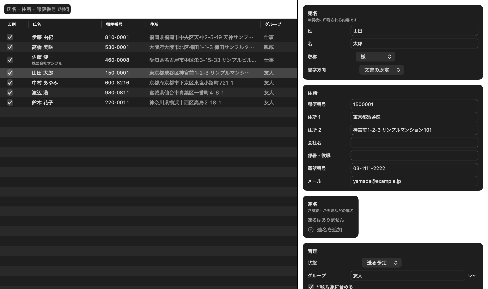
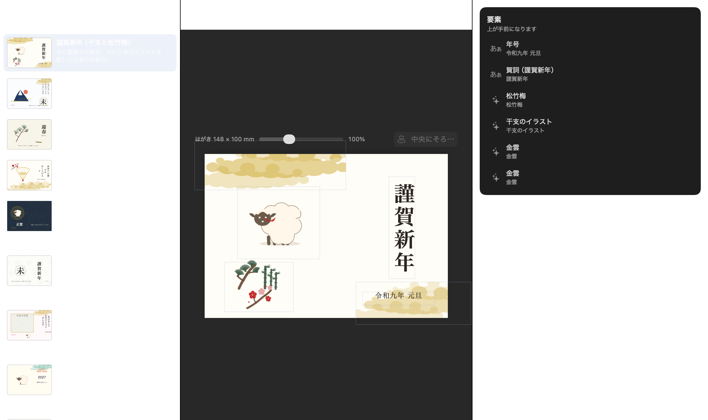
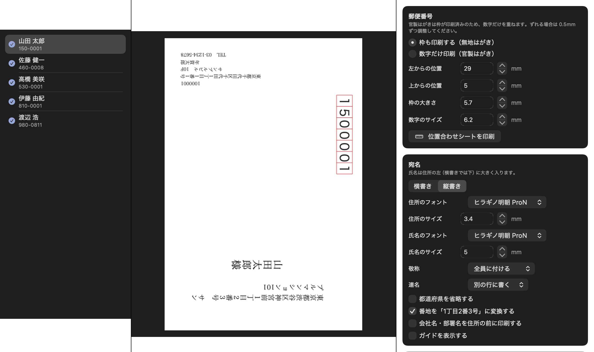
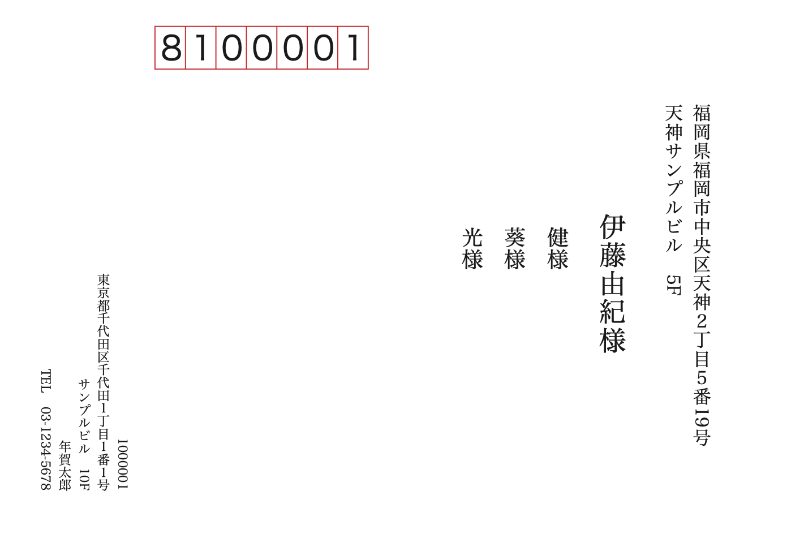
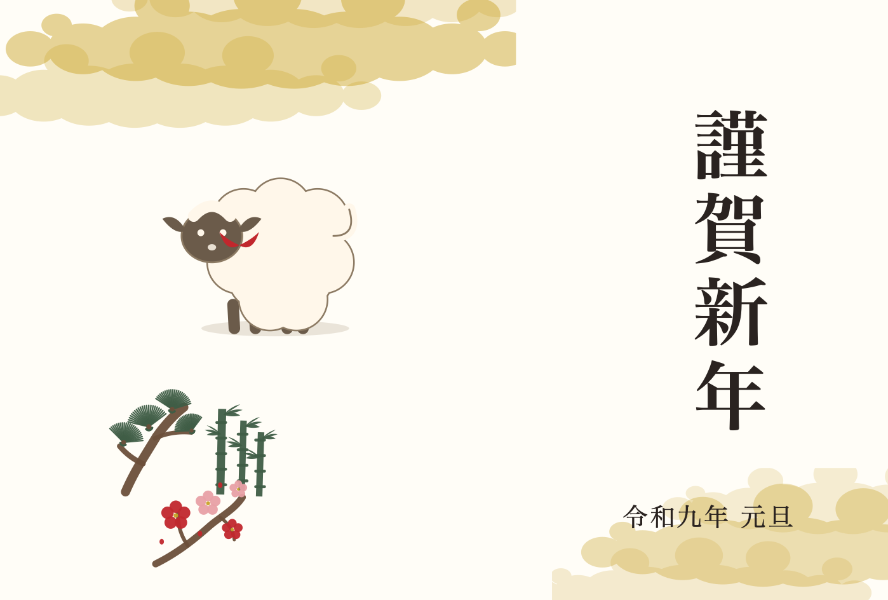

# 年賀スタジオ（NengaStudio）

macOS 用の年賀状ソフトです。住所録の管理から文面（裏面）のデザイン、宛名面
（表面）のレイアウト、はがき実寸での印刷・PDF 書き出しまでを 1 つのアプリで
行います。SwiftUI と Core Graphics / Core Text だけで書いたネイティブアプリで、
外部ライブラリには依存していません。

`筆まめ` などの市販ソフトとは無関係のオリジナル実装です。テンプレート・イラスト・
名称はすべてこのリポジトリのために作ったもので、他社の素材や商標は使っていません。



## できること

**住所録**

- 氏名・敬称・郵便番号・住所・会社・電話・メール・グループ・備考の管理
- 連名（ご家族・ご夫婦）と、連名ごとの敬称
- 状態（送る予定 / 送付済み / 受領済み / 喪中 / 送らない）と印刷対象の切り替え
- CSV の取り込みと書き出し（UTF-8 / BOM 付き UTF-8 / Shift-JIS、見出しの表記ゆれを自動判定）
- 番地の「1丁目2番3号」変換、都道府県の省略、郵便番号の整形

**文面（裏面）**

- はがき実寸（100×148mm）のキャンバスで、テキスト・図形・モチーフ・写真を配置
- 縦書き・横書きの両対応。句読点の位置、長音や括弧の回転、算用数字の縦中横まで面倒を見ます
- 干支（2027 年は未・ひつじ）のイラスト、松竹梅、富士山、南天、水引、扇、金雲、
  麻の葉、七宝などの和のモチーフをベクターで内蔵
- テンプレート 11 種（和風・シンプル・写真・カジュアル・ビジネス・喪中はがき・寒中見舞い）
- 宛名の差し込み（`{姓}` `{名}` `{氏名}` `{連名}` `{住所}` `{年号}` `{干支}`）

**宛名面（表面）と印刷**

- 郵便番号枠（7 桁）の位置と大きさを 0.5mm 単位で調整。官製はがきは数字だけを重ねる設定
- 宛名の縦書き・横書き、氏名と住所のフォント・サイズ、敬称の付け方、連名の並べ方
- 差出人欄（左下・右下、縦書き・横書き、電話・メールの有無）
- プリンタごとの位置ずれ補正（左右・上下）と、印刷の向き 4 通り
- 印刷、PDF 書き出し、位置合わせシートの印刷、文面の PNG 書き出し



## 動作環境

- macOS 14 以降（開発と確認は macOS 26.6 / Xcode 26.6 で行っています）
- ビルドには Xcode が必要です（SwiftUI のマクロが Xcode 同梱のツールチェーンに
  あるため、Command Line Tools だけではビルドできません）

## ビルドと起動

```sh
# ビルドして dist/NengaStudio.app を作る
./scripts/make-app.sh release

# ビルドして ~/Applications に置き、起動する
./scripts/run.command
```

`scripts/build.sh` は SwiftPM のスクラッチ先をローカル（`~/Library/Caches/nenga-studio`）
に逃がし、index store を無効にしています。このリポジトリを外部ボリュームに置いた
場合、スクラッチ先をボリューム上にすると index store の書き込みで失敗するためです。
場所を変えたいときは `NENGA_SCRATCH` を指定してください。

コマンドラインから見本を書き出すこともできます。

```sh
BIN=$(./scripts/build.sh --show-bin-path | tail -1)

"$BIN/NengaStudio" --render-samples out     # 宛名面・文面・位置合わせシートの PDF と PNG
"$BIN/NengaStudio" --render-ui out          # 画面のスクリーンショット
"$BIN/NengaStudio" --make-sample out/sample.nenga
"$BIN/NengaStudio" --make-icon out/icon.png
"$BIN/NengaStudio" --self-check             # 書類の保存・読み戻し・PDF・印刷設定の自己診断
"$BIN/NengaStudio" --inspect out/sample.nenga
```

## 使い方の流れ

1. 起動して「New Document」で新しい年賀状を作ります（`⌘N`）。ファイル 1 つ
   （`.nenga` パッケージ）に住所録・文面・写真がまとまって保存されます。
2. 「設定」で差出人（自分の住所・氏名・電話）と年（既定は翌年）を入力します。
3. 「住所録」で宛先を追加するか、`⌘⇧I` で CSV を取り込みます。初回は
   「サンプル住所録を読み込む」で動きを確認できます。
4. 「文面デザイン」でテンプレートを選び、文字や写真を調整します。
5. 「宛名印刷」で仕上がりを確認し、「位置合わせシートを印刷」でプリンタとの
   ずれを確認してから本番の宛名を印刷します。



## 印刷の勘所

はがきは短辺 100mm を幅にして縦送りで印刷する機種が一般的です。このアプリは
用紙の向きを 4 通り（縦送り 2 通り・横送り 2 通り）から選べます。まず
**位置合わせシート**を印刷し、実際のはがきを重ねて郵便番号枠と四隅のトンボを
確認してください。ずれた分は「左右の補正」「上下の補正」で 0.5mm ずつ調整でき
ます。

- 官製はがきは赤い郵便番号枠が印刷済みなので、「数字だけ印刷」を選びます。
  無地のはがきに印刷するときは「枠も印刷する」にします。
- 年賀はがきのお年玉くじ番号が印刷されている下部（約 12mm）には、宛名面の
  レイアウトが重ならないようにしています。ガイド表示で範囲を確認できます。
- 文面ははがきの外形でクリップしてから描画するため、紙の外へはみ出した絵柄が
  プリンタ内に印刷されることはありません。

詳しくは [docs/printing.md](docs/printing.md) にまとめています。

## 宛名面と文面の見本

| 宛名面（縦書き・連名あり） | 文面（謹賀新年） |
| --- | --- |
|  |  |

## 実装の構成

```
Sources/NengaCore/          モデルと描画エンジン（UI 非依存・テスト可能）
  Model/                    住所録・文面・テンプレート・はがき規格
  Render/                   縦書き組版（TextEngine）・モチーフ（MotifRenderer）・面の描画
  Export/                   PDF / PNG / 印刷用のページ変換
  CSV/                      CSV の解析と書き出し
  Store/                    .nenga パッケージの読み書き
Sources/NengaStudio/        SwiftUI アプリ
  App/                      書類（DocumentGroup）とメニュー
  Views/                    住所録・文面デザイン・宛名印刷・設定
  CLI/                      見本の描画、画面画像、アイコン生成
Tests/NengaCoreTests/       Swift Testing による回帰テスト
scripts/                    ビルド・アプリ作成・起動
docs/                       印刷の注意点と実装メモ、画像
```

設計の詳細は [docs/implementation.md](docs/implementation.md) に書いています。

## テスト

```sh
./scripts/test.sh
```

住所の整形、CSV（Shift-JIS・引用符・見出しのゆれ）、干支と和暦、郵便番号枠の
座標、縦書きの回転・字詰め、テンプレート、`.nenga` の読み書き、PDF のページ数と
用紙サイズを確認します。

## 制限

- 干支のイラストは 2027 年（未・ひつじ）を収録しています。他の年を選ぶと、
  干支の漢字を円相で囲んだ紋に自動で切り替わります。
- 郵便番号から住所を引くデータベースは同梱していません（住所は手入力か CSV で
  取り込んでください）。
- 筆まめなどの他社形式ファイルの直接取り込みには対応していません。CSV を経由
  してください。

## ライセンス

[LICENSE](LICENSE)（MIT）を参照してください。

## 連絡先

不具合の報告や質問は softwareclone@proton.me までお願いします。
